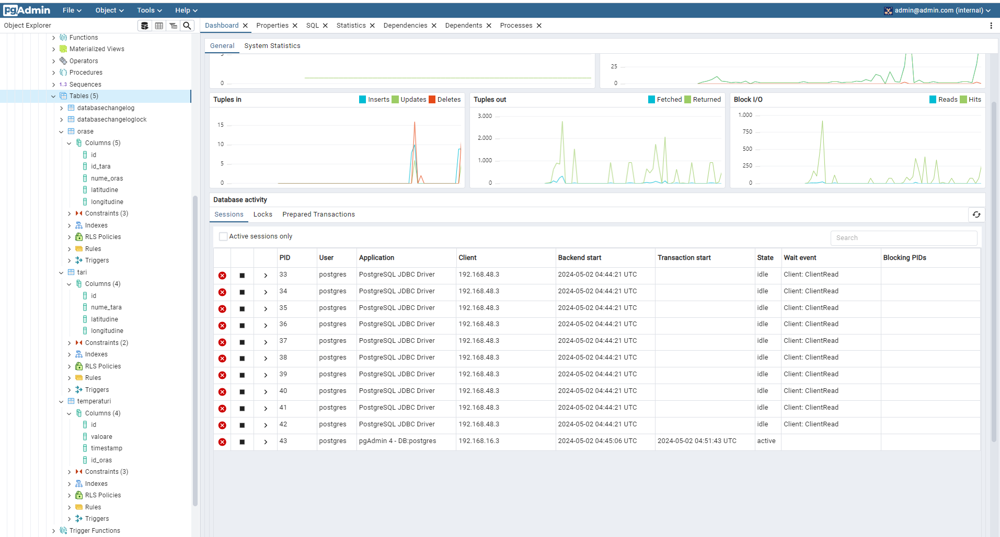
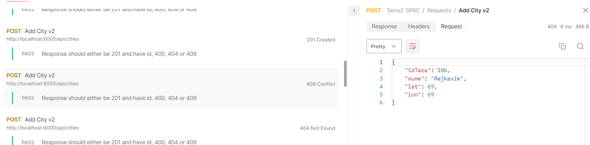

# Temperature-Monitor

This README provides a comprehensive guide on how the Docker-related requirements and REST API error handling are
implemented within the project.

## Docker Configuration

### Docker Compose Setup

**File**: `docker-compose.yaml`

- **Description**: Defines three main services—`springboot-app`, `postgres`, and `pgadmin`, each configured for specific
  roles and grouped within Docker networks to enhance security and simplify management.
- **Networks and Volumes**:
    - **Networks**:
        - `backend` includes `springboot-app` and `postgres` to facilitate direct communication and enhance performance.
        - `admin_network` is dedicated to `pgadmin` for isolated database management.
        - `common_network` connects `postgres` and `pgadmin`, allowing administrative access to the database.
    - **Volumes**:
        - `postgres_data` ensures data persistence for the PostgreSQL database across container restarts.

Networks
```yaml
networks:
  backend:
    driver: bridge
  admin_network:
    driver: bridge
  common_network:
    driver: bridge
```

Volumes
```yaml
volumes:
  postgres_data: {}
```


### Dockerfile

**File**: `Dockerfile`

- **Description**: Implements a multi-stage build process for the `springboot-app` to optimize the Docker image by
  separating build and runtime environments, enhancing both security and efficiency.

### Key Docker Components

- **Environment Variables**: Used to dynamically configure services like `postgres` or `pgadmin`, facilitating 
    customization such as database credentials directly via Docker Compose settings.

```yaml
environment:
  PGADMIN_DEFAULT_EMAIL: admin@admin.com
  PGADMIN_DEFAULT_PASSWORD: root
```

- **Persistence with Volumes**: The `postgres_data` volume is crucial for maintaining database state across Docker
  container lifecycle events.

```yaml
    volumes:
      - postgres_data:/var/lib/postgresql/data
```

- **Named DNS Usage**: Facilitates service discovery within Docker networks by allowing services to refer to each other
  by names like `postgres`, simplifying inter-service communication.

```yaml
  pgadmin:
    depends_on:
      - postgres  # Uses named DNS
```

## REST API Error Handling

### Countries API (`TariController.java`)

- **Error Handling**:
    - **POST** `/api/countries`: Checks for invalid input and duplicate entries, responding with appropriate HTTP status
      codes (201, 400, 409).
    - **PUT** `/api/countries/{id}`: Validates the existence of the country and handles errors like non-existent country
      IDs (200, 400, 404).
    - **DELETE** `/api/countries/{id}`: Ensures the country exists before attempting deletion, managing error scenarios
      with suitable HTTP responses (200, 400, 404).

### Cities API (`OraseController.java`)

- **Error Handling**:
    - **POST** `/api/cities`: Includes checks for missing country references and validates input data types, responding
      to errors with suitable HTTP status codes (201, 400, 404, 409).
    - **PUT** `/api/cities/{id}`: Confirms the city's existence and validates modifications, handling errors
      comprehensively (200, 400, 404, 409).
    - **DELETE** `/api/cities/{id}`: Verifies city existence before deletion, managing potential errors effectively (
      200, 400, 404).

### Temperatures API (`TemperaturiController.java`)

- **Error Handling**:
    - **POST** `/api/temperatures`: Manages invalid inputs and checks for the existence of referenced city IDs, using
      structured error responses (201, 400, 404, 409).
    - **GET** `/api/temperatures`: Includes filtering logic with robust handling of incorrect or incomplete query
      parameters, ensuring reliable data retrieval (200).
    - **PUT** `/api/temperatures/{id}`: Updates temperature data after validating the existence and correctness of the
      temperature record, handling inconsistencies or errors in input (200, 400, 404, 409).
    - **DELETE** `/api/temperatures/{id}`: Confirms the existence of the temperature record before proceeding with
      deletion, providing clear feedback on error scenarios (200, 400, 404).

### **Note**

- The errors are handled in a specific order. If a request has more than 1 problem, the first error will be returned.

For example:

```java
@PutMapping("/{id}")
public ResponseEntity<?> updateTemperature(@PathVariable Integer id, 
                                           @RequestBody Map<String, 
                                           Object> requestData) {
    if (!requestData.keySet().containsAll(expectedKeys)) {
        return new ResponseEntity<>("Missing required parameters.", 
                                    HttpStatus.BAD_REQUEST);
    }
    if (!expectedKeys.containsAll(requestData.keySet())) {
        return new ResponseEntity<>("Unexpected extra parameters found.", 
                                    HttpStatus.BAD_REQUEST);
    }
    if (!id.equals(bodyId)) {
        return new ResponseEntity<>("ID mismatch between URL and body", 
                                    HttpStatus.BAD_REQUEST);
    }
    // Other code...
}
```

With the request:

```http request
PUT http://localhost:6000/api/temperatures/145

Body:
{
    "nume": 69
}

Response:
"Missing required parameters."
```

So even if the Body also has invalid data, the first check (requred paramters) will be the first one to return an error.

## Database Constraints and Timestamp Handling

### Country Table Creation

**File**: `create_country_table.sql`

- Ensures unique constraints on country names.

```
nume_tara VARCHAR(255) UNIQUE NOT NULL
```

### City Table Creation

**File**: `create_city_table.sql`

- Implements unique constraints on a combination of country ID and city name.

```
CONSTRAINT orase_unic UNIQUE (id_tara, nume_oras)
```

### Temperature Table Creation

**File**: `create_temperature_table.sql`

- Ensures temperature records are unique per city and timestamp.

```
CONSTRAINT temperaturi_unic UNIQUE (id_oras, timestamp)
```

- Timestamps are stored in high precision, transformed to match 'yyyy-MM-dd' for
  API interactions as noted in [forum discussions](https://curs.upb.ro/2023/mod/forum/discuss.php?d=1719).

```java

@Column(name = "timestamp", nullable = false)
@JsonFormat(pattern = "yyyy-MM-dd'T'HH:mm:ss.SSSSSS")
private LocalDateTime timestamp = LocalDateTime.now();
```

```java
public List<Temperaturi> getTemperaturiByFilter(Double lat, 
                                                Double lon, 
                                                LocalDate from, 
                                                LocalDate until) {
    // Other code...
    LocalDate temperatureDate = temperatura.getTimestamp().toLocalDate();
    matchesDate = (!temperatureDate.isBefore(from)) && 
                  (!temperatureDate.isAfter(until));
}
```

## Additional Configuration

- **File**: `application-local.yaml`
    - Contains configuration settings crucial for setting up the application's environment-specific parameters,
      enhancing the functionality and adaptability of the application across different deployment environments.

## PgAdmin



Since this application uses named DNS, the connection uses 'postgres' instead of the IP address: 


## Tests

**All test results**


**Examples**

These are some of the tests that illustrate different scenarios.

- POST Country

  201 Created
  

  409 Conflict
  

- POST City

  201 Created
  

  409 Conflict
  

  

  404 Not Found
  

  

- PUT Temperature

  400 Bad Request
  

  

  200 OK
  

